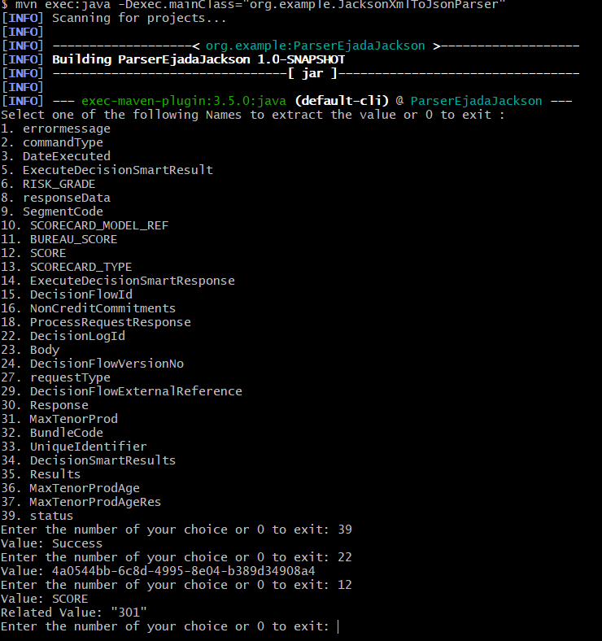

# ParserEjadaJackson

# XML to JSON Parser Using Jackson
This project demonstrates how to parse an XML file, convert it to JSON using Jackson, and display the node names for user interaction. The user can select a node, and the program will show its corresponding value.

# Features!
-Reads XML from a file.
- Convert XML to Json
- Extracts specific key-value pairs from the JSON data.
- Stores the data in a map for easy retrieval.
- Skips certain fields (e.g., the array or the NON-objects) based on specific conditions.
- Handles nested JSON structures and arrays.
- interact with the end user to retrive the selected node
- Maven
- CI ready (run maven commands)

# Prerequisites
- Java 8 or higher "JDK and JRE"
- Maven for dependency management
- IntelliJ IDEA (or any Java IDE)

# Dpendecies
jackson plugin and already added to POM file

# Setup Instructions
1. Clone the Repository
   Project is hosted on GitHub, clone it using the following command:
```sh
$ git clone https://github.com/reemahmed-ejada/ParserEjadaJackson.git
```

2- Build the Project from the directory which contain the cloned project

```sh
$ mvn clean install
```
3-Install the dependencies using this command

```sh
$ mvn dependency:sources
```
4- Run

```sh
mvn exec:java -Dexec.mainClass="org.example.JacksonXmlToJsonParser"
```
5- Output will be shown to user


